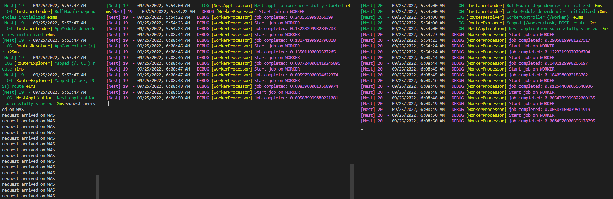

### Design CPU intensive tasks with queues
- WAS: Send tasks to task queus and do not process tasks in WAS instance, act as producers. It will delegate tasks to other processes.
- WORKER: As a comsumer, it will process takss from queues.


### Advantages and Disadvantages of Queue
* Advantages
  - Asynchronous: tasks can be saved in queues and handled later.
  - Decoupling: Worker processes can be seperated from WAS process.
  - Scalable
  - Resilience: one task failure does not affect other tasks.

* Disadvantages
  - Searching is not easy: its difficult to search tasks in queues.
  - Difficult to insert: its not possible to insert between the tasks that are already in queues.


### Run 
```shell
sh ./run.sh
docker logs -f nest-worker-was
docker logs -f nest-worker-1
docker logs -f nest-worker-2

/POST localhost:20000/task

```
